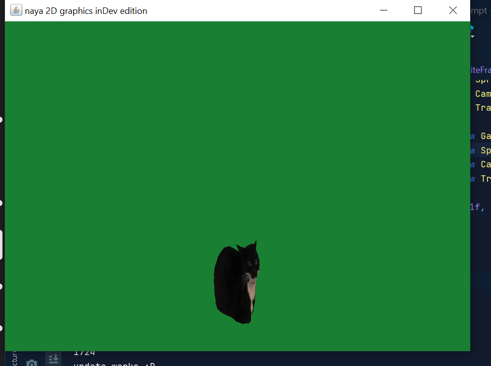

# GameEngine2D


the naya engine.

2D game engine coded by me TheoW03


how to get started  


1. download these 2 dependecies

    version: 2.3.2

    https://jar-download.com/artifacts/org.jogamp.gluegen/gluegen-rt

    version 1.10.5

    https://jar-download.com/artifacts/org.joml

    and requires java 17

2. create a new class that extends ``GameRenderer``
and in main call the Window class
like this

``Window w = new Window(width, height, name of app, instance of gamerender)``
3. once you do that follow below

-----   
create a new GameObject

name what you want and add comepents,
like this

```GameObject.AddCompenent()```

to Edit the compenent use

``GameObject.GetCompenent(Compenent.class)``

as of right now each compenent is required a sprite

but im going to fix it you wont need to 

to remove

``GameObject.RemoveCompenent(Compenent.class)``

you can also add your own scripts have it

``extend iComponent``

``update(dt)``
runs every frame

``init(dt)`` is the 1st frame

enjoy :)


example of how it looks ^

in the future I plan to add a text based gameObject editor

and physics. and lighting.

